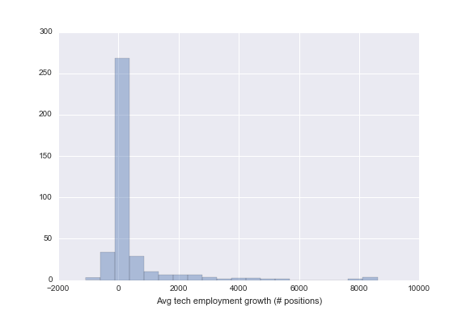
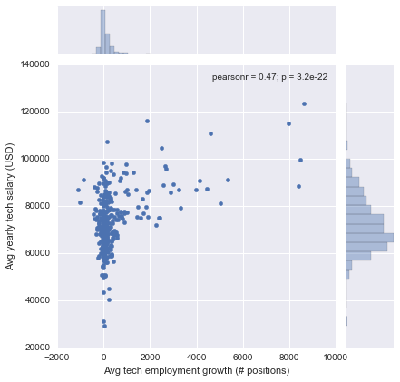
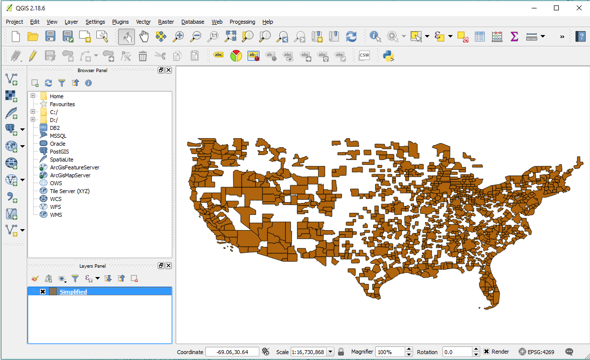

<!-- .slide: data-state="no-toc-progress" --> <!-- don't show toc progress bar on this slide -->

# Data Mashups
<!-- .element: class="no-toc-progress" --> <!-- slide not in toc progress bar -->

## <span style="color: #ffa3d5"> Remix</span> Your Way to Interactive Visualizations

created by [vivshaw](https://vivshaw.github.io/) | 2017-04-19 | [online][1] | [src][2]

[folium](3) | [leaflet](4) | [odyssey](5)


[1]: https://vivshaw.github.io/4-19-public-data-talk/
[2]: https://github.com/vivshaw/4-19-public-data-talk/
[3]: https://vivshaw.github.io/4-19-public-data-talk/folium-app/
[4]: https://vivshaw.github.io/4-19-public-data-talk/leaflet-app/
[5]: https://vivshaw.github.io/4-19-public-data-talk/odyssey/

----  ----

# 1. Your humble host...

----

## ...Hannah Vivian Shaw

> "Who the heck is she?"
>
> -- <cite>You guys, probably</cite>

<div class="fragment" />

* BA in Economics & Philosophy, UVM
  * Secret identity: software engineer!
  * <!-- .element: class="fragment" --> `let interests = (econ_stats, code) => data_science`
* <!-- .element: class="fragment" -->
  __Don't be afraid to say 'Hi'!__
  * <!-- .element: class="fragment" --> [vivshaw.github.io](https://vivshaw.github.io/)
  * <!-- .element: class="fragment" --> [twitter.com/irreduce](https://vivshaw.github.io/)

----

## On the topic of public data

<div class="fragment" />
Initial thought: Public economic datasets - a natural fit for business. There's lots of comprehensive, clean data out there with direct business relevance.

<div class="fragment" />
Ulterior motive: 'Yay, a chance to revisit my old stomping grounds & build some neat visualizations!'

----

## Where to find economic data?

* <!-- .element: class="fragment" -->Domestic data
  * [Bureau of Labor Statistics](https://www.bls.gov/home.htm) - employment, prices, compensation
  * [Federal Reserve Economic Data (Fred)](https://fred.stlouisfed.org/) -> macro, monetary, financial
  * [Bureau of Economic Analysis](https://www.bea.gov/) -> macro, trade, regional
* <!-- .element: class="fragment" -->International data
  * [World Bank](http://data.worldbank.org/) -> literally everything imaginable, from everywhere imaginable

----  ----

# 2. Posing our question

----

# Where are the hottest spots for tech-sector employment in 2016?

----

## Perhaps you are...

<div class="fragment" />
...a startup, looking to avoid the high costs and market saturation of SF or NY?

<div class="fragment" />
...or, an established tech firm looking for locations for a branch office?

<div class="fragment" />
...or, a tech recruiter looking to expand your range for talent-hunting?

<div class="fragment" />
* Whichever it is, an accurate picture of where tech-sector employment is growing is crucial to the success of this business venture.
* The perfect way for you to build this picture: public economic & geographic datasets!

----  ----

## 3. Sorting out our economic data

The Bureau of Labor Statistics maintains a comprehensive [Occupational Employment Statistics](https://www.bls.gov/oes/home.htm) (OES) program
* Employment data available broken down by occupational profiles & groups thereof
* Temporal granularity: yearly (released each Spring)
* Spatial granularity: national, state, metropolitan statistical area (MSA)
* We'll use MSAs, as we want the most granular understanding of where the job growth is at!

----

## Scrub-a-dub-dub, data cleaning time!

We'll use Pandas, because it's awesome. 

```
xl = pd.ExcelFile(filename)
df = xl.parse(xl.sheet_names[0])

# Drop non tech sector jobs
df = df.drop(df[df.OCC_CODE != "15-0000"].index)
# Drop any rows with missing data
df = df.drop(bls[(bls.A_MEAN == '*') | (bls.JOBS_1000 == '**') | (bls.TOT_EMP == '**')].index)

# Convert some columns to numeric datatypes
to_convert = ['TOT_EMP', 'JOBS_1000', 'A_MEAN']
bls[to_convert] = bls[to_convert].apply(pd.to_numeric)

# Return only chosen columns
return df['AREA', 'AREA_NAME', 'TOT_EMP', 'JOBS_1000', 'A_MEAN']
```

----

## Merge, merge, merge

We'll grab the past three years of OES data and merge 'em together. Pandas makes this as easy as a SQL join:

```
from functools import reduce

inner_join_by_area = lambda x, y: pd.merge(x, y, on='AREA', how='inner')
bls_merged = reduce(inner_join_by_area, bls_data)
```

----

## Our target indicator: average job growth

Let's just grab our total employment in the sector for each year, subtract, and do a quick average...

```
bls_merged['2016_EMP_GROWTH'] = tot_emp['2016_TOT_EMP'] - tot_emp['2015_TOT_EMP']
bls_merged['2015_EMP_GROWTH'] = tot_emp['2015_TOT_EMP'] - tot_emp['2014_TOT_EMP']
bls_merged['AVG_EMP_GROWTH'] = (tot_emp['2016_EMP_GROWTH'] + tot_emp['2015_EMP_GROWTH']) / 2

```

----

## Preliminary EDA

We can already start to see some neat stuff. Let's look at our dataframe:

```
In[1]: tot_emp[['AREA', 'AREA_NAME_x', 'AVG_EMP_GROWTH']].sort_values('AVG_EMP_GROWTH', ascending=False)
Out[1]: 
      AREA                                          AREA_NAME  AVG_EMP_GROWTH
43   41940                 San Jose-Sunnyvale-Santa Clara, CA          8605.0
227  35084                Newark, NJ-PA Metropolitan Division          8470.0
90   12060                  Atlanta-Sandy Springs-Roswell, GA          8385.0
42   41884  San Francisco-Redwood City-South San Francisco...          7940.0
30   31084  Los Angeles-Long Beach-Glendale, CA Metropolit...          5355.0
21   38060                        Phoenix-Mesa-Scottsdale, AZ          5040.0
353  42644  Seattle-Bellevue-Everett, WA Metropolitan Divi...          4595.0
205  16740                  Charlotte-Concord-Gastonia, NC-SC          4440.0
314  19124      Dallas-Plano-Irving, TX Metropolitan Division          4130.0
309  12420                              Austin-Round Rock, TX          3980.0
193  28140                                 Kansas City, MO-KS          3300.0
186  33460            Minneapolis-St. Paul-Bloomington, MN-WI          3235.0
..     ...                                                ...             ...
```

----

## Lemme throw some plots at ya



----

## Lemme throw some plots at ya



----  ----

# 4. Geographic data

----

## Mapping with MSAs

We need to map with MSAs, but there's not really a Python tool that does that.

Public data to the rescue again!
* The [US Census Bureau](https://www.census.gov/en.html) provides a dataset of [cartographic boundaries](https://www.census.gov/geo/maps-data/data/cbf/cbf_msa.html) in the form of [shapefiles](https://en.wikipedia.org/wiki/Shapefile).
* We'll use these to build a map

----

## Teach me how to QGIS (Data cleaning, round 2)

Problem: these shapefiles are huge! A dataset of ZIP code shapefiles is over 1.3 GB. These MSA shapefiles are more reasonable at 30ish MB, but we want something more svelte.

<div class="fragment" />
* We'll need to use a [geographic information system](https://en.wikipedia.org/wiki/Geographic_information_system) (GIS) like [ArcGIS](https://www.arcgis.com/features/index.html) or [QGIS](http://qgis.org/en/site/) to edit & compress the shapefiles

----

## QGIS in action



----

## Portable markup for great justice!

Now that we've fixed up our shapefiles, we need them in a format we can actually use.

<div class="fragment" />
__[geoJSON](http://geojson.org/) to the rescue!__
* A portable markup format for geographic data & shapes
* Bindings available for most languages

We can convert shapefiles to geoJSON using the [Geospatial Data Abstraction Library](http://www.gdal.org/index.html)'s cli tool `ogr2ogr`

----  ----

# 6. Map Time

----

## Our choropleth options

<div class="fragment" />
Static
* R - [choroplethr](https://github.com/trulia/choroplethr)
* Python - [geopandas](http://geopandas.org/), [cartopy](http://scitools.org.uk/cartopy/)

<div class="fragment" />
Dynamic
* Python - [folium](https://github.com/python-visualization/folium)
* Javascript - roll-your-own with [leaflet.js](http://leafletjs.com/)

----

## Attempt 1: Folium

[I tried Folium](https://vivshaw.github.io/4-19-public-data-talk/folium-app/).

Pros:
* It looks quite nice
* Great if you don't want to learn JS just to make a map app

Cons:
* Not very interactive by default
* Fine-tuning is sometimes tough

----

## Even better: Leaflet

Since I know JS already, I decided to make an [even better choropleth](https://vivshaw.github.io/4-19-public-data-talk/leaflet-app/) in Leaflet.

Pros:
* Incredibly customizable
* Web native
* Super slick looking

Cons:
* You have to be a web developer

----

## Telling the story with [odyssey.js](https://cartodb.github.io/odyssey.js/)

(Data journalists, this one's for you!)

Once you've drawn some conclusions, odyssey.js will let you make a map [into an interactive story map](https://vivshaw.github.io/4-19-public-data-talk/odyssey/).

----

<!-- .slide: data-state="no-toc-progress" --> <!-- don't show toc progress bar on this slide -->

### *Thanks for your time, everyone!*
<!-- .element: class="no-toc-progress" -->
